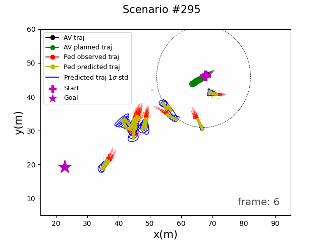
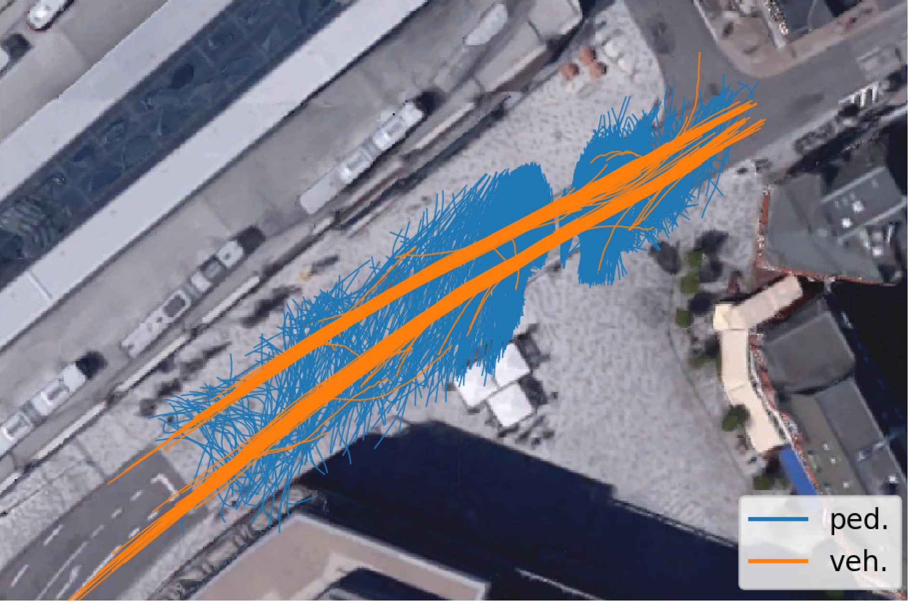

# PedMove_gym

This repository provides a 2D gym environment that simulates pedestrian trajectories in the presence of vehicles within a shared space. It is designed for training and testing decision-making algorithms for the ego vehicle navigating among these pedestrians. The pedestrian trajectory behaviors are derived from the [HBS dataset](https://leopard.tu-braunschweig.de/receive/dbbs_mods_00069907), which was captured in a shared space in Germany.


A unique feature of this gym environment is its integration with a data-driven pedestrian trajectory predictor algorithm called Uncertainty-aware Polar Collision Grid (UAW-PCG). As a result, the [PCG](https://github.com/Golchoubian/PolarCollisionGrid-UncertaintyAware) algorithm's predictions are included as example states within this simulation environment.

<div style="display: block; margin: 0 auto; text-align: center; padding-bottom: 200px;">
     
     
    <figcaption>[1]</figcaption>
</div>


This gym environment was used in our paper to train a deep reinforcement learning-based navigation algorithm for an autonomous vehicle navigating among pedestrians in a shared space. It is part of the complete [code](https://github.com/Golchoubian/UncertaintyAware_DRL_CrowdNav) provided for implementing our algorithm within the paper and can also be used for other reinforcement learning algorithms.


<font size="1">
[1]: Cheng, Hao, and Monika Sester. "Modeling mixed traffic in shared space using lstm with probability density mapping." In 2018 21st International Conference on Intelligent Transportation Systems (ITSC), pp. 3898-3904. IEEE, 2018.
</font>

## Installation

Create a  virtual environment or conda environmnet using python version 3.9, and Install the required python packages:

```bash
pip install -r requirements.txt
```

Install pytorch version 1.12.1 using the instructions [here](https://pytorch.org/get-started/previous-versions/#v1121):

```bash
pip install torch==1.12.1 torchvision==0.13.1 torchaudio==0.12.1

```

## Overview

This repository is organized in two main folders:

* `envs/`: Contatins the files for the simulation environment.

* `ped_pred/`: Includes files for running inference on our pedestrian trajectory prediction model, [UAW-PCG](https://github.com/Golchoubian/PolarCollisionGrid-UncertaintyAware). =

This simulation environmnt consist of 310 scenarios extracted from the HBS dataset, each of these scenarios corresponds to one of the vehicles presnet in this dataset. The scenarios are divided into training, testing, and validation sets. Pedestrian behaviors are be simulated using real-world data, while the ego vehicle's actions can be decided based on DRL algortihm. 

The simulation environment being developed, based on real trajectory data, also provides the advantage of having human-driven trajectories for each scenario, which can be compared with the trajectories of AVs' trained navigation policy. 

## Usage

There are configuration that can be adjusted in the following two files, wih some of the key paramters explained as follows:

* `PedMove_gym/config.py`: 

- `sim.predict_method` provides three options for the the integrated prediction with the simulation environment

  - `inferred`: Generate the pedestrians predicted trajectory based in UAW-PCG predictor model.
  - `none`: Does not provide any prediction.
  - `truth`: Outputs the ground truth prediction from the dataset.

- `sim.render` if set to `True` the simualation enviroenment will be visualize and the scenarios will be stored as a git in the `Simulated_scenarios/gifs` directory

- ` action_space.kinematics` specifies the options for the ego vehcile (robot)'s kinematics, with the following options:
  - ``holonomic`
  - `unicycle`


* `PedMove_gym/arguments.py`: 

- `phase` specifies the phase from which the scenarios will be executed:
  - `train`
  - `val` (validation)
  - `test`

- `test_case` specfies the scenarios to runs within the specifed phase:
  - `-1`: Runs all scenarios within that phase
  - `A single number in raneg: [0-310]`: Run the specified scenario number

    Note: A valid scenario number should be enterd for the specifed phase based no the following division made during the scenario split for train, validation, and test:
    - validation: scenario numbers: 0 - 48
    - train: scenario numbers: 48 - 247
    - test: scenario numbers: 248 - 310

- `consider-veh` is a boolean specifying whether to also consider and visualize other vehicles in the scenario other than the eog vehicle or not

  

As this repository is focused only on providing the gym simulatino environment of the pedestrians real traejctry behavior in presnece of vehciles in a shared environment while being integrated with the predestrian trajectroy prediction model, the actios on the ego vehicle is based on the human-driver's real trajectorty in the dataset with the `robot.human_driver` being set to `True`. However, a decision-making algorith can be placed for outputiing the action. An example of such an algorithm can be find in [UncertaintyAware_DRL_CrowdNav](https://github.com/Golchoubian/UncertaintyAware_DRL_CrowdNav).


## Citation
```bibtex
@inproceedings{golchoubian2023polar,
  title={Polar Collision Grids: Effective Interaction Modelling for Pedestrian Trajectory Prediction in Shared Space Using Collision Checks},
  author={Golchoubian, Mahsa and Ghafurian, Moojan and Dautenhahn, Kerstin and Azad, Nasser Lashgarian},
  booktitle={2023 IEEE 26th International Conference on Intelligent Transportation Systems (ITSC)},
  pages={791--798},
  year={2023},
  organization={IEEE}
}
```
